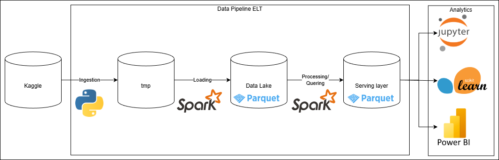

# Data Analytics - PUCPR
## TDE - B3 (BM&FBovespa) 1986-2019 Equities Price
### Descrição
Este TDE consiste em um projeto completo de Analytics contendo deste a pipeline de dados até análises e Machine Learning, a arquitetura do projeto como um todo se da conforme o diagrama abaixo: 

### Requisitos:
* Python >= 3.11
* Java >= 17
* Docker Desktop

### Como rodar o projeto
Para rodar a pipeline ELT, assim fazendo a ingestão dos dados e carregamento no Data Lake, rode o comando:
> docker compose up --build

Após o armazenamento dos dados no Data Lake, é necessário configurar o ambiente Python para realizar as extrações de dados, análises e treinamento/inferência dos modelos de ML com os comandos:
> python -m venv .venv  
> pip install -r requirements.txt

Na pasta src/quering/ existe um arquivo chamado quering.ipynb que realiza a extração dos dados para os casos de uso de Analytics, esses dados devem ser salvos em datalake/serving/.  
Para a aplicação das análises e treinamento/inferênicas dos modelos de ML, os dados devem ser lidos da pasta datalake/serving/, considerando que nesta pasta os dados estarão processados para serem utilizados.  
Os dados do Data Lake são armazenados no formato parquet particionados por ano e mês, já os dados disponibilizados na Serving Layer em csv.

### Equipe
Gabriel Ribeiro Estefanski 
Giordano Diniz Serafini 
Guilherme Sampaio Furquim 
Victor Gabriel Eidt Bragagnolo 
Vinicius Yudi Sumiyoshi Alves 